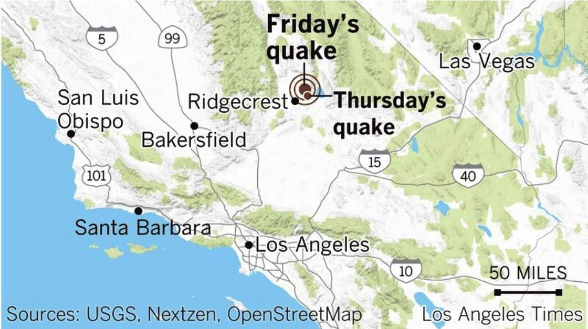

# Earthquake in Ridgecrest, California

On Friday, July 5, 2019 a large earthquake rocked the small southern 
California town of Ridgecrest. The earthquake measaured **7.1** on the _Richter Scale_ as could be felt as far away as Mexico.
This is the **largest** earthquake in years for California and is estimated to be **one hundred** times stronger 
than Thursdays quake. The _USGS_ 
stated 
>It is likely there will be smaller earthquakes, As few as 40 or as many as 84 such earthquakes may occur

Fact about the Ridgecrest Earthquake
* First earthquake occured on July 4, 2019
    * Friday's earthquake was larger
* No confirmed deaths, mainly structre damgage
* Residents of California are urged to be ready for larger quakes
    * Link to prepardness site: [Ready](http://ready.gov/earthquakes)

